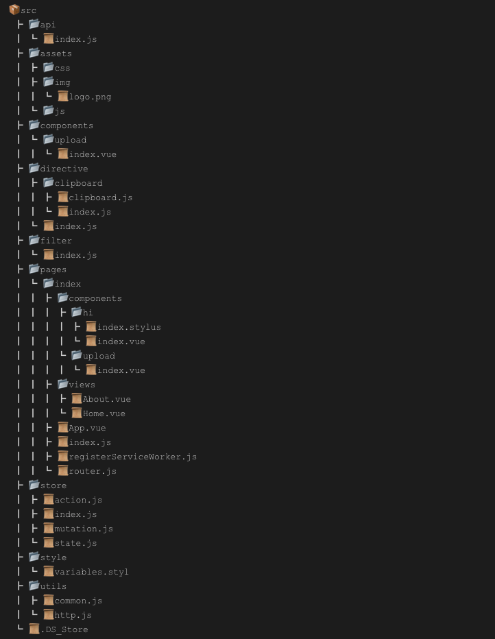

# Vue + Vuex + Element/Mint/Antd
## 项目架构


## Project setup
```
yarn install
```

### 开发环境
```
yarn run serve
```

### 生产环境
```
yarn run build
```

### 项目测试
```
yarn run test
```

### 遵循原则
> 1.最小化组件拆分  

> 2.单一职责模式  

> 3.多用函数式编程方式 map, filter, reduce, some, any, forEach, every  

> 4.页面文件不超过300行，超过考虑拆分组件

> 5.命名规范  

    1.css 使用BEM命名规范  

    2.js 驼峰式命名  

    3.组件 大驼峰命名  

    4.文件和文件夹 驼峰式命名